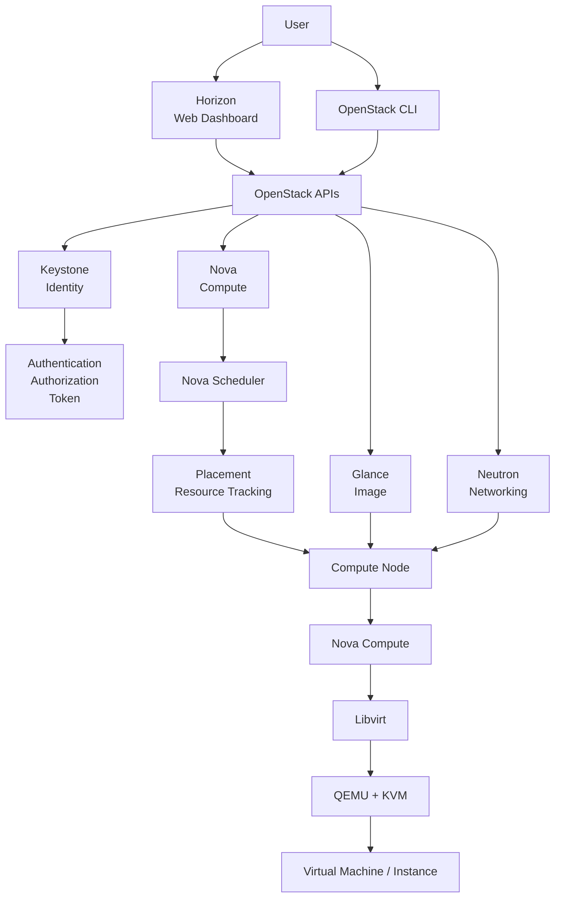

# OpenStack Overview

## 1. OpenStack là gì?

OpenStack là một nền tảng mã nguồn mở dùng để xây dựng và vận hành hệ thống cloud computing.

OpenStack không phải là một hypervisor như VMware ESXi hay một hệ thống quản lý hypervisor đơn thuần như Proxmox. OpenStack là một tập hợp nhiều service phối hợp với nhau để cung cấp các tài nguyên cloud thông qua API.

Các tài nguyên chính mà OpenStack quản lý bao gồm:

- Compute: máy ảo (Instance)
- Network: network, subnet, router, port, floating IP
- Image: image dùng để tạo máy ảo
- Storage: block/object storage tùy kiến trúc triển khai
- Identity: user, project, role và quyền truy cập
- Resource management: theo dõi và phân bổ tài nguyên

Người dùng có thể tương tác với OpenStack thông qua:

- OpenStack CLI
- Horizon Web Dashboard
- REST API

---

## 2. OpenStack giải quyết bài toán gì?
Nếu chỉ sử dụng KVM/QEMU, administrator có thể tạo và chạy VM.

Tuy nhiên khi hệ thống có nhiều VM, nhiều server và nhiều user thì việc quản lý thủ công sẽ trở nên phức tạp.

Ví dụ:

Ai được phép tạo VM?
VM nên chạy trên server nào?
Server nào còn đủ CPU/RAM?
Image Ubuntu nằm ở đâu?
VM kết nối vào network nào?
VM được cấp IP nào?
User nào được phép truy cập VM?
Làm thế nào để quản lý tất cả thông qua API?
Làm thế nào để quản lý hàng trăm hoặc hàng nghìn VM?

OpenStack giải quyết các vấn đề này bằng cách chia hệ thống thành nhiều service chuyên biệt.

---

## 3. Kiến trúc tổng thể

Một OpenStack deployment có thể được chia thành các lớp chính:


Luồng xử lý tổng quát

Có thể hiểu kiến trúc trên theo các lớp:

1. User Layer

Người dùng tương tác với OpenStack thông qua:

Horizon
OpenStack CLI
REST API

2. API Layer

Các request được gửi tới OpenStack API và được xử lý bởi các service tương ứng.

3. Core Services

Các service chính gồm:

Service	Vai trò
Keystone	Authentication, Authorization và Service Catalog
Nova	Compute và quản lý Instance
Neutron	Networking
Glance	Image management
Placement	Theo dõi và quản lý resource

4. Compute Layer

Nova Scheduler lựa chọn Compute Node phù hợp dựa trên resource và các policy.


Sau đó Nova Compute trên Compute Node thực hiện việc tạo và quản lý Instance.

5. Virtualization Layer

Nova Compute sử dụng Libvirt để giao tiếp với QEMU/KVM.

---

# 4. Các service chính của OpenStack

OpenStack được xây dựng từ nhiều service độc lập. Mỗi service đảm nhiệm một chức năng riêng nhưng chúng phối hợp với nhau thông qua API, message queue, database và Identity Service.

---

## 4.1. Keystone - Identity

Keystone là Identity Service của OpenStack.

Chức năng chính:

- Authentication
- Authorization
- Quản lý User
- Quản lý Project
- Quản lý Role
- Quản lý Token
- Service Catalog

Có thể hiểu đơn giản:

> Keystone trả lời câu hỏi: "Ai đang thực hiện request và người đó có quyền gì?"


## 4.2. Glance - Image Service

Glance là Image Service của OpenStack, chịu trách nhiệm quản lý các image được sử dụng để tạo Instance.

Ví dụ:

- Ubuntu
- CentOS
- Debian
- Windows

Luồng cơ bản:

```text
User
  |
  v
Glance
  |
  v
Image
  |
  v
Nova
  |
  v
Instance
```

Glance chịu trách nhiệm quản lý image, nhưng không trực tiếp tạo VM.


## 4.3. Placement - Resource Placement

Placement quản lý thông tin về resource provider và khả năng cung cấp tài nguyên của hệ thống.

Các loại resource có thể bao gồm:

- VCPU
- RAM
- Disk
- Các loại resource khác

Placement được Nova sử dụng để biết:

> "Compute Node nào đang có tài nguyên phù hợp để chạy Instance này?"

Luồng đơn giản:

```text
Nova
  |
  v
Placement
  |
  v
Resource Inventory
  |
  v
Compute Node phù hợp
```

## 4.4. Nova - Compute Service

Nova là Compute Service và chịu trách nhiệm chính trong việc quản lý Instance.

Nova thực hiện các chức năng như:

- Create Instance
- Delete Instance
- Start / Stop Instance
- Schedule Instance
- Quản lý Compute Resource
- Giao tiếp với Compute Node

Nova không trực tiếp thực hiện toàn bộ quá trình tạo VM.

Có thể chia Nova thành nhiều thành phần:

```text
Nova API
   |
   v
Nova Scheduler
   |
   v
Nova Compute
   |
   v
Libvirt
   |
   v
QEMU/KVM
   |
   v
Virtual Machine
```


## 4.5. Neutron - Networking Service

Neutron là Networking Service của OpenStack.

Neutron chịu trách nhiệm quản lý networking trong OpenStack.

Các chức năng chính:

- Network
- Subnet
- Port
- Router
- Security Group
- IP Address
- Connectivity giữa các Instance

Ví dụ:

```text
Instance
   |
   v
Neutron Port
   |
   v
Network
   |
   v
Subnet
   |
   v
Router
   |
   v
External Network
```

Neutron quyết định Instance được kết nối mạng như thế nào.


## 4.6. Horizon - Dashboard

Horizon là Web Dashboard của OpenStack.

Thay vì sử dụng CLI:

```bash
openstack server create ...
```

User có thể sử dụng giao diện web để:

- Tạo Instance
- Tạo Network
- Tạo Volume
- Upload Image
- Quản lý User
- Xem Resource

Horizon không trực tiếp tạo VM.

Horizon gọi OpenStack API.

Luồng:

```text
User
  |
  v
Horizon
  |
  v
OpenStack API
  |
  +---- Keystone
  +---- Nova
  +---- Neutron
  +---- Glance
  +---- Cinder
```


## 4.7. Cinder - Block Storage

Cinder là Block Storage Service của OpenStack.

Cinder cung cấp Block Storage cho Instance.

Có thể hiểu tương tự một block device / virtual disk được cung cấp cho VM.

Các chức năng:

- Create Volume
- Delete Volume
- Attach Volume
- Detach Volume
- Snapshot Volume

Ví dụ:

```text
Instance
   |
   +---- Root Disk
   |
   +---- Cinder Volume
```

# 5. Luồng tạo một Instance

Tạo một Instance trong OpenStack không phải là công việc của riêng Nova.

Để một Instance được tạo thành công, nhiều service phải phối hợp với nhau:

- Keystone: Authentication và Authorization
- Nova: Compute lifecycle
- Placement: Resource tracking
- Glance: Image
- Neutron: Networking
- Libvirt + QEMU/KVM: Virtualization

Có thể hình dung luồng tổng quát:

```text
User
  |
  v
Horizon / OpenStack CLI
  |
  v
Keystone
  |
  | Authentication / Token
  v
Nova API
  |
  +------------------+
  |                  |
  v                  v
Placement          Glance
  |                  |
  | Resource         | Image
  |                  |
  +--------+---------+
           |
           v
     Nova Scheduler
           |
           v
      Compute Node
           |
      Nova Compute
           |
        Libvirt
           |
       QEMU / KVM
           |
           v
        Instance
```

Neutron tham gia vào quá trình để cung cấp networking cho Instance.

---

## 5.1. Bước 1 - User gửi request

User có thể tạo Instance thông qua:

- OpenStack CLI
- Horizon
- REST API

Ví dụ sử dụng CLI:

```bash
openstack server create \
    --flavor m1.small \
    --image ubuntu \
    --network private \
    vm01
```

Request này chứa các thông tin quan trọng như:

- Tên Instance
- Flavor
- Image
- Network

User không cần trực tiếp chỉ định VM sẽ chạy trên server vật lý nào.

Việc lựa chọn Compute Node được OpenStack xử lý thông qua Nova Scheduler.

---

## 5.2. Bước 2 - Keystone xác thực User

Request cần được xác thực trước khi các service xử lý.

Keystone kiểm tra:

- User
- Password / credential
- Project
- Role
- Authorization

Nếu authentication thành công, Keystone cấp token.

```text
User
  |
  | Credentials
  v
Keystone
  |
  | Authentication successful
  v
Token
```

Token sau đó được sử dụng trong các request tới OpenStack API.

---

## 5.3. Bước 3 - Nova API nhận request

Sau khi user đã được authentication, request tạo Instance được gửi tới Nova API.

Nova API là entry point của Compute Service.

```text
User
  |
  v
Nova API
  |
  v
Create Instance Request
```

Nova API tiếp nhận request và bắt đầu quá trình xử lý Instance.

---

## 5.4. Bước 4 - Nova xác định các resource cần thiết

Nova cần xác định Instance yêu cầu bao nhiêu tài nguyên.

Thông tin này được xác định bởi Flavor.

Ví dụ:

```text
Flavor: m1.small

vCPU: 1
RAM: 2 GB
Disk: 20 GB
```

Nova cần tìm một Compute Node có đủ tài nguyên để chạy Instance.

---

## 5.5. Bước 5 - Placement cung cấp thông tin Resource

Placement theo dõi resource của các Resource Provider.

Ví dụ:

```text
Compute01
    |
    +-- VCPU
    +-- Memory
    +-- Disk

Compute02
    |
    +-- VCPU
    +-- Memory
    +-- Disk
```

Nova Scheduler sử dụng thông tin từ Placement để tìm Compute Node phù hợp.

Có thể hiểu đơn giản:

> Placement cho biết tài nguyên đang có.

> Nova Scheduler sử dụng thông tin đó để lựa chọn nơi Instance sẽ chạy.

---

## 5.6. Bước 6 - Nova Scheduler lựa chọn Compute Node

Nova Scheduler lựa chọn Compute Node phù hợp với yêu cầu của Instance.

Ví dụ:

```text
Instance yêu cầu:

1 vCPU
2 GB RAM

             Available Resource

Compute01    8 vCPU / 16 GB RAM
Compute02    1 vCPU /  1 GB RAM

             |
             v

Compute01 được lựa chọn
```

Việc lựa chọn host không chỉ dựa trên CPU/RAM mà còn phụ thuộc vào các filter, weigher, policy và các điều kiện khác của deployment.

---

## 5.7. Bước 7 - Glance cung cấp Image

Instance cần một image để khởi tạo hệ điều hành.

Ví dụ:

```text
Ubuntu Image
```

Nova tương tác với Glance để lấy thông tin và image cần thiết.

```text
Nova
  |
  v
Glance
  |
  v
Ubuntu Image
```

Image sau đó được sử dụng trong quá trình tạo Instance trên Compute Node.

---

## 5.8. Bước 8 - Neutron cung cấp Networking

Instance cần network để giao tiếp với các hệ thống khác.

Neutron quản lý các network resource cần thiết.

Ví dụ:

```text
Network
   |
   v
Subnet
   |
   v
Port
   |
   v
Instance
```

Các thành phần có thể liên quan:

- Network
- Subnet
- Port
- Security Group
- Router
- Floating IP

Ví dụ Instance có thể được kết nối vào:

```text
private network
        |
      subnet
        |
       port
        |
    Instance
```

Nếu Instance cần truy cập external network, Router và Floating IP có thể được sử dụng tùy theo kiến trúc networking.

---

## 5.9. Bước 9 - Compute Node nhận request

Sau khi Scheduler lựa chọn Compute Node, request được chuyển tới Nova Compute trên node đó.

Ví dụ:

```text
Nova Scheduler
       |
       v
Compute01
       |
       v
Nova Compute
```

Nova Compute là thành phần chạy trên Compute Node và chịu trách nhiệm quản lý Instance trên hypervisor.

---

## 5.10. Bước 10 - Nova Compute sử dụng Libvirt

Nova Compute không trực tiếp điều khiển KVM bằng cách xử lý mọi thao tác virtualization.

Nova Compute sử dụng Libvirt để giao tiếp với virtualization layer.

```text
Nova Compute
     |
     v
  Libvirt
     |
     v
QEMU / KVM
```

Libvirt cung cấp interface để quản lý Virtual Machine.

---

## 5.11. Bước 11 - QEMU/KVM tạo và chạy Instance

QEMU/KVM thực hiện virtualization trên Compute Node.

```text
Libvirt
   |
   v
QEMU + KVM
   |
   v
Virtual Machine
```

KVM cung cấp hardware-assisted virtualization thông qua Linux kernel.

QEMU cung cấp virtual machine hardware và phối hợp với KVM để chạy Instance.

---

## 5.12. Bước 12 - Instance được kết nối Network

Sau khi Instance được tạo, Instance được kết nối vào Neutron network thông qua virtual networking.

Có thể hình dung:

```text
Instance
   |
   v
Virtual NIC
   |
   v
Neutron Port
   |
   v
Virtual Network
   |
   v
External / Tenant Network
```

Instance có thể nhận Fixed IP từ subnet.

Nếu cần truy cập từ external network, Floating IP có thể được sử dụng tùy cấu hình.

---

# 5.13. Tổng hợp toàn bộ flow

Toàn bộ quá trình có thể tóm tắt:

```text
1. User
   |
   v
2. Horizon / CLI
   |
   v
3. Keystone
   |
   | Authentication
   v
4. Nova API
   |
   +----> Placement
   |       |
   |       +---- Resource information
   |
   +----> Glance
   |       |
   |       +---- Image
   |
   +----> Neutron
   |       |
   |       +---- Network / Port
   |
   v
5. Nova Scheduler
   |
   v
6. Selected Compute Node
   |
   v
7. Nova Compute
   |
   v
8. Libvirt
   |
   v
9. QEMU / KVM
   |
   v
10. Instance
```

---

# 5.14. Vai trò của từng Service trong Flow

| Thành phần | Vai trò trong quá trình tạo Instance |
|---|---|
| Keystone | Xác thực User và cung cấp Identity/Token |
| Nova API | Nhận request tạo Instance |
| Placement | Theo dõi và cung cấp thông tin resource |
| Nova Scheduler | Lựa chọn Compute Node |
| Glance | Cung cấp Image |
| Neutron | Cung cấp Networking |
| Nova Compute | Quản lý Instance trên Compute Node |
| Libvirt | Interface quản lý virtualization |
| QEMU/KVM | Thực hiện virtualization |
| Instance | Workload cuối cùng được tạo |

---

# 6. Quan hệ và giao tiếp giữa các OpenStack Service

OpenStack không phải là một ứng dụng đơn lẻ. Hệ thống gồm nhiều service chạy trên các process khác nhau và cần giao tiếp với nhau để hoàn thành một request.

Có ba cơ chế quan trọng cần phân biệt:

- API communication
- Message Queue
- Database

Ngoài ra, Keystone đóng vai trò Identity Service và cung cấp Service Catalog để các client/service biết cách tìm đến các OpenStack API.

---

## 6.1. API Communication

Các OpenStack service cung cấp API để client hoặc service khác gửi request.

Ví dụ:

```text
OpenStack CLI
      |
      v
Nova API
      |
      v
Nova Service
```

Hoặc:

```text
Horizon
   |
   v
OpenStack API
   |
   +---- Keystone
   +---- Nova
   +---- Neutron
   +---- Glance
   +---- Placement
```

API là cơ chế giao tiếp ở tầng service.

Thông qua API, client có thể yêu cầu OpenStack thực hiện các thao tác như:

- Create Instance
- Delete Instance
- Create Network
- Create Subnet
- Upload Image
- Create Volume
- List Resource

---

## 6.2. Keystone trong quá trình giao tiếp

Keystone không phải message broker và cũng không phải database.

Keystone chịu trách nhiệm về Identity.

Ví dụ User muốn gọi Nova API:

```text
User
  |
  | Credentials
  v
Keystone
  |
  | Token
  v
Nova API
```

Nova sử dụng thông tin authentication để xác định:

- User là ai
- Project nào
- Scope của request
- User có quyền thực hiện request hay không

Do đó Keystone là một thành phần nền tảng trong quá trình giao tiếp với OpenStack API.

---

## 6.3. Service Catalog

Keystone còn cung cấp Service Catalog.

Service Catalog chứa thông tin về các OpenStack service và endpoint tương ứng.

Ví dụ:

```text
Service Catalog
|
+-- Keystone
|    |
|    +-- Endpoint
|
+-- Nova
|    |
|    +-- Endpoint
|
+-- Glance
|    |
|    +-- Endpoint
|
+-- Neutron
|    |
|    +-- Endpoint
|
+-- Placement
     |
     +-- Endpoint
```

Khi OpenStack client cần gọi một service, client có thể sử dụng Service Catalog để xác định endpoint của service đó.

---

# 6.4. Message Queue

OpenStack có nhiều process và service chạy phân tán.

Không phải mọi thành phần đều giao tiếp trực tiếp với nhau bằng HTTP API.

Một số thành phần sử dụng Message Queue để trao đổi message.

Trong deployment phổ biến, RabbitMQ được sử dụng làm Message Broker.

Ví dụ:

```text
Nova API
   |
   | Message
   v
RabbitMQ
   |
   v
Nova Scheduler / Nova Compute
```

Message Queue giúp các process trao đổi công việc mà không cần tất cả thành phần phải gọi trực tiếp lẫn nhau.

---

## 6.5. RabbitMQ

RabbitMQ là Message Broker.

Vai trò chính:

- Nhận message
- Queue message
- Chuyển message tới consumer
- Hỗ trợ giao tiếp giữa các process/service

Có thể hình dung:

```text
Producer
   |
   v
RabbitMQ
   |
   v
Consumer
```

Trong OpenStack:

```text
Nova API
   |
   v
RabbitMQ
   |
   v
Nova Compute
```

RabbitMQ không phải database.

RabbitMQ cũng không phải nơi lưu trữ image hoặc VM.

Nó chủ yếu đảm nhiệm việc truyền message giữa các process.

---

# 6.6. Database

Các OpenStack service cần database để lưu trữ state và metadata.

Trong mô hình lab, MariaDB được sử dụng làm database backend.

Ví dụ:

```text
MariaDB
|
+-- Keystone DB
+-- Nova DB
+-- Neutron DB
+-- Glance DB
+-- Placement DB
```

Mỗi service có thể sử dụng database/schema riêng tùy kiến trúc triển khai.

---

## 6.7. MariaDB

MariaDB là relational database.

Database được sử dụng để lưu các thông tin cần thiết cho hoạt động của service.

Ví dụ:

```text
Keystone
   |
   v
MariaDB
   |
   +-- Identity information

Nova
   |
   v
MariaDB
   |
   +-- Compute related information

Neutron
   |
   v
MariaDB
   |
   +-- Network related information
```

Database không phải nơi VM thực sự chạy.

VM chạy trên Compute Node thông qua QEMU/KVM.

---

# 6.8. API và Message Queue khác nhau như thế nào?

Đây là điểm rất dễ nhầm khi mới học OpenStack.

### API

API thường được sử dụng khi một client hoặc service cần gửi request tới một service.

Ví dụ:

```text
User
  |
  | HTTP Request
  v
Nova API
```

### Message Queue

Message Queue được sử dụng để các process/service trao đổi message và công việc thông qua broker.

Ví dụ:

```text
Nova API
   |
   | Message
   v
RabbitMQ
   |
   v
Nova Compute
```

Có thể nhớ:

> API = gửi request tới service.

> Message Queue = truyền message giữa các process/service.

---

# 6.9. API, Message Queue và Database

Ba thành phần này có vai trò khác nhau:

| Thành phần | Vai trò |
|---|---|
| API | Interface để client/service gửi request |
| RabbitMQ | Message broker giữa các process/service |
| MariaDB | Lưu trữ database/state |
| Keystone | Identity, Authentication, Authorization và Service Catalog |

Có thể hình dung:

```text
                    User
                      |
                      v
                  Keystone
                      |
                   Token
                      |
                      v
                 OpenStack API
                      |
          +-----------+-----------+
          |                       |
          v                       v
      Message Queue            Database
       RabbitMQ                MariaDB
          |                       |
          v                       v
      OpenStack              Service State
       Processes
```

---

# 6.10. Ví dụ: Nova API và Nova Compute

Khi User tạo Instance, Nova API nhận request.

Nova API không trực tiếp chạy VM.

Một phần công việc được điều phối tới các thành phần Nova khác.

Có thể khái quát:

```text
User
  |
  v
Nova API
  |
  v
Nova Scheduler
  |
  v
Selected Compute Node
  |
  v
Nova Compute
```

Message Queue có thể được sử dụng để các process Nova trao đổi message.

Sau đó Nova Compute thực hiện việc quản lý Instance trên Compute Node.

---

# 6.11. Ví dụ: Nova và Placement

Nova Scheduler cần biết Compute Node nào có tài nguyên phù hợp.

Placement cung cấp thông tin về resource provider và allocation.

```text
Nova Scheduler
      |
      | Resource query
      v
Placement
      |
      v
Resource Information
      |
      v
Nova Scheduler
```

Scheduler sử dụng thông tin này cùng với các filter, weigher và policy để lựa chọn Compute Node.

---

# 6.12. Ví dụ: Nova và Glance

Nova cần image để tạo Instance.

Glance quản lý image.

```text
Nova
  |
  | Image request
  v
Glance
  |
  v
Image
```

Nova sử dụng image đó trong quá trình tạo Instance.

---

# 6.13. Ví dụ: Nova và Neutron

Instance cần networking.

Nova phối hợp với Neutron để Instance có network resource phù hợp.

```text
Nova
  |
  | Network request
  v
Neutron
  |
  +-- Network
  +-- Subnet
  +-- Port
  +-- Security Group
  |
  v
Instance Networking
```

Neutron chịu trách nhiệm phần networking.

Nova chịu trách nhiệm phần compute/lifecycle của Instance.

---

# 6.14. Tổng thể giao tiếp giữa các Service

Có thể hình dung một request tạo Instance như sau:

```text
                         User
                           |
                           v
                    Horizon / CLI
                           |
                           v
                       Keystone
                           |
                         Token
                           |
                           v
                       Nova API
                           |
             +-------------+-------------+
             |             |             |
             v             v             v
        Placement       Glance        Neutron
             |             |             |
             |             |             |
             +-------------+-------------+
                           |
                           v
                    Nova Scheduler
                           |
                           v
                    Compute Node
                           |
                      Nova Compute
                           |
                        Libvirt
                           |
                       QEMU / KVM
                           |
                           v
                        Instance
```

Trong quá trình này:

```text
MariaDB
   |
   +---- Service databases

RabbitMQ
   |
   +---- Message communication
```

Keystone cung cấp Identity và Service Catalog cho toàn bộ hệ thống.

---

# 6.15. Control Plane Communication

Control Plane bao gồm các thành phần quản lý và điều phối.

Ví dụ:

```text
                 Controller
                     |
       +-------------+-------------+
       |             |             |
       v             v             v
   Keystone        Nova         Neutron
       |             |             |
       +-------------+-------------+
                     |
              RabbitMQ / MariaDB
```

Các service trên Controller xử lý request và điều phối hoạt động của hệ thống.

---

# 6.16. Data Plane

Data Plane là nơi workload thực tế chạy.

Ví dụ:

```text
              Compute Node
                    |
              Nova Compute
                    |
                 Libvirt
                    |
                QEMU/KVM
                    |
                    v
                 Instance
```

Neutron cũng có các thành phần thực hiện networking trên các node tùy theo backend được lựa chọn.

Do đó:

```text
Control Plane
    |
    | Điều khiển
    v
Data Plane
    |
    +-- Compute
    +-- Network
    +-- Storage
```

---


